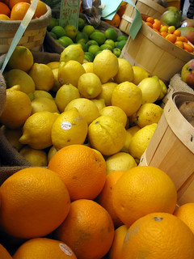
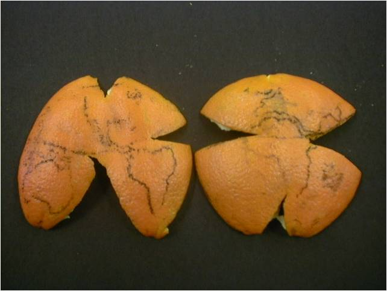
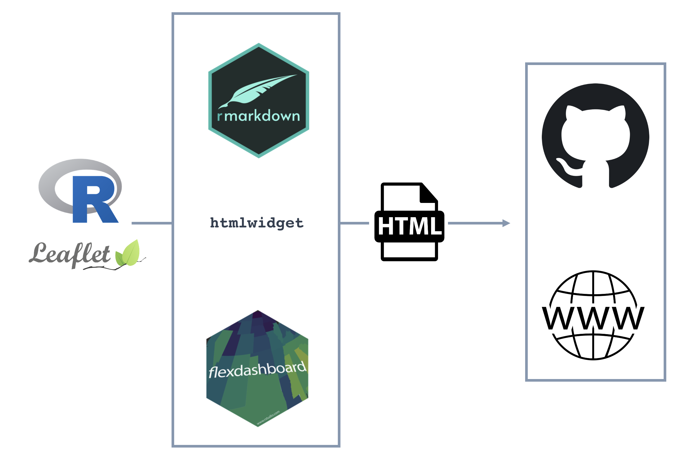

```{r configuracion, include = FALSE}
library(knitr)
library(tidyverse)
library(fontawesome)
library(emo)
library(xaringanExtra)
library(tidyverse)
library(raster)

# set default options
opts_chunk$set(echo=FALSE,
               warning=FALSE,
               collapse = TRUE,
               dpi = 300,
               fig.align = "center")
knit_engines$set("yaml", "markdown")

xaringanExtra::use_tile_view()
xaringanExtra::use_clipboard()
xaringanExtra::use_share_again()
xaringanExtra::style_share_again(
  share_buttons = c("twitter", "linkedin", "pocket")
)

options(htmltools.preserve.raw = FALSE)
```

class: inverse, middle, center

`r fontawesome::fa("map", height = "3em")`
# ¿Cómo generar <br>visores de datos espaciales con `r fa("r-project", fill = "steelblue")`? 

---

## ... para este .red[brico-Seminario] vamos a necesitar 


> ### `r fa("map-pin", fill = "steelblue")` <br> **Información** para mostrar (espacial) 

<br>

> ### `r fa("wrench", fill = "steelblue")` <br> **Herramienta** para crear el `mapa` que queremos mostrar 

<br>

> ### `r fa("desktop", fill = "steelblue")` <br> Un **lugar** donde mostrar/alojar el mapa que hemos creado

---

class: middle, center

`r fontawesome::fa("map-pin", height = "5em", fill = "steelblue")`
# Información Espacial  

---

# Tipos de datos

# Proyección

# Datum 

---

### `r fontawesome::fa("bezier-curve", fill = "steelblue")`  Modelo vectorial 

```{r, echo=FALSE, out.width='70%', fig.align='center'}
knitr::include_graphics("img/vectors.png")
```

---

### `r fontawesome::fa("border-all", fill = "steelblue")`  Modelo raster 

```{r, echo=FALSE, out.width='70%', fig.align='center'}
knitr::include_graphics("img/raster_concept.png")
```

---

## Sitema de Referencia de Coordenadas 

- Datos espaciales = datos + CRS 

- Modelo matemático que conecta los datos con la superficie de la Tierra

- CRS le dice al software (QGIS, R, ...) en que **espacio geográfico** está la información, y qué **metodo** usar **para proyectar** la información sobre el espacio geográfico 

### "Estándares" para compartir la información CRS
  
  - [proj](http://proj4.org/):
```{r, comment="#", tidy=TRUE} 
  proj4string(CRS("+init=epsg:4326"))
```

```{r, comment="#", tidy=TRUE}
  proj4string(CRS("+init=epsg:4230"))
```
  - [EPSG](https://spatialreference.org/ref/epsg/): 
  
```{r, comment="#", tidy=TRUE}
CRS("+init=epsg:4326")
```

???
Una estructura de datos no puede considerarse geoespacial si no va acompañada de información del sistema de referencia de coordenadas (CRS), en un formato que las aplicaciones geoespaciales puedan utilizar para mostrar y manipular los datos correctamente. La información CRS conecta los datos con la superficie de la Tierra mediante un modelo matemático.

https://mappinggis.com/2016/04/los-codigos-epsg-srid-vinculacion-postgis/


---
class:center, middle 

### The peel analogy 

> #### CRS = `Datum` + `Proyección` + `parámetros adicionales` 

.pull-left[

] 

.pull-right[

] 


???
- Imagina que la tierra es una naranja. La forma en la que la pelamos y la aplanamos es similar a lo que hace una proyección. 
- El datum se refiere a la elección de la fruta: ¿es la tierra una naranja, un limón, una lima? 
- La proyección es la forma de pelar la cáscara y luego aplanar la piel
- Otros parámetros adicionales pueden referirse a la ubicación del tallo de la naranja 

---

## Recursos sobre Información espacial + `r fa("r-project", height= "2em", fill = "steelblue")`

- [Análisis espacial con R: Usa R como un Sistema de Información Geográfica](https://eujournal.org/files/journals/1/books/JeanFrancoisMas.pdf). J.F. Mas. 

- [GIS with R](https://pakillo.github.io/GISwithR/GISwithR.html). F. Rodríguez-Sánchez 

- [Geocomputation with R](https://geocompr.robinlovelace.net/). R. Lovelace et *al.* (2022)

- Varios tutoriales de [NEON](https://jsta.github.io/r-spatial-data-management-intro/spatial-data-gis/)

- [r-spatial](https://r-spatial.org/about/). Pebesma et *al.*
 
- [Spatial Data Science with R](https://rspatial.org/)

- `r fa("r-project", fill = "steelblue")` [Cran Task View](https://cran.r-project.org/web/views/Spatial.html)

- [R Projections Workshop](https://github.com/MicheleTobias/R-Projections-Workshop)

- [World Map Projections](https://michaelminn.net/tutorials/gis-projections-world/index.html)

- [Cheatseet de CRS in R](https://www.nceas.ucsb.edu/sites/default/files/2020-04/OverviewCoordinateReferenceSystems.pdf). NCEAS 

---

### Información a mostrar 

```{r, echo=FALSE}
library(tidyverse)
library(here)
library(raster)
```

```{r, echo=TRUE, tidy=TRUE, fig.height=5, fig.align='center'}
library(sf)
sn <- st_read(here::here("data/sn_enp.shp"), quiet = TRUE) #<<
plot(st_geometry(sn))
```


---

¿Qué proyección tiene nuestra capa? 
```{r, echo=TRUE, results='asis'}
projection(sn)
```

```{r, echo=TRUE, results='asis'}
sn <- st_transform(sn, 4326)
projection(sn)
```


---

class: middle, center

`r fontawesome::fa("wrench", height = "5em", fill = "steelblue")`
# **Herramienta** para crear el `mapa` 

---

class: middle

```{r, echo=FALSE, out.width='70%', fig.align='center'}

```
<br>
<br>

- Librería JavaScript de código abierto para generar mapas interactivos 

- Sencilla, simple y ligera 

- Gran cantidad de [**plugins**](https://leafletjs.com/plugins.html) que permiten incorporar nuevas características a los mapas 

  - proyecciones<sup>1</sup>: `epsg:3857`, `epsg:4326`. [Proj4Leaflet](http://kartena.github.io/Proj4Leaflet/)


.footnote[
[1] [mappingGIS](https://mappinggis.com/2017/02/personalizando-los-sistemas-de-coordenadas-en-leaflet/)
]
---
class: inverse, middle, center

```{r, echo=FALSE, out.width='70%', fig.align='center'}

```

# +

# `r fa("r-project", height= "4em", fill = "steelblue")`


https://rstudio.github.io/leaflet/
---
### Uso básico 

```{r, echo = TRUE, out.width = '100%', out.height='50%', fig.align='center'}
library(leaflet)

mapita <- leaflet() %>% 
  # Añadir capas 
  addTiles() %>% # Open Street map
  # Añadir otras capas 
  addMarkers(lng=-3.311572, lat=37.053434, popup="Mulhacen")

mapita
```
---

### Añadir otras capas 

```{r, echo = TRUE, out.width = '100%', out.height='50%', fig.align='center'}
mapita %>% 
  addPolygons(data = sn,
              group= 'Natural Park',
              fillOpacity = 0, 
              color = "blue") 
```

---

### Añadir control de capas 

```{r, echo=FALSE}
mapita <- mapita %>%   
  addPolygons(data = sn,
              group= 'Natural Park',
              fillOpacity = 0, 
              color = "blue") 
```


```{r, echo = TRUE, out.width = '100%', out.height='50%', fig.align='center'}
mapita %>% 
  addLayersControl(position = 'bottomright',
                   baseGroups = c('Open Street Map'),
                   overlayGroups = c('Natural Park')) 
```

---
### Capas base
- Otros [proveedores](https://leaflet-extras.github.io/leaflet-providers/preview/) de mapas base 

 
```{r, echo = TRUE, out.width = '100%', out.height='50%', fig.align='center'}

mapita %>% 
  addProviderTiles("Esri.WorldImagery", 
                   group = "Satellite (ESRI)") %>% 
  addLayersControl(position = 'bottomright',
                   baseGroups = c('Open Street Map', 
                                  'Satellite (ESRI)'),
                   overlayGroups = c('Natural Park')) 
```

---
### Capas base (WMS)

- **W**eb **M**ap **S**ervices protocolo estándar (Open Geospatial Consortium) que sirve imágenes de mapas a partir de información geográfica. 

- Fuentes de WMS:

  - [IDE España](https://www.idee.es/segun-tipo-de-servicio)
  - [IGN España](https://www.ign.es/web/ign/portal/ide-area-nodo-ide-ign)
  - [Biodiversidad y Bosques](https://www.miteco.gob.es/es/cartografia-y-sig/ide/directorio_datos_servicios/biodiversidad/wms_bdn.aspx) (MITECO)
  - [REDIAM - Andalucía](https://portalrediam.cica.es/geonetwork/static/search?serviceType=OGC:WMS)
  - Predicciones del tiempo: [OpenWeatherMaps](https://openweathermap.org/api/weather-map-2)

---

#### ¿Qué capa utilizar de un servicio WMS?<sup>1</sup> 

`URL WMS` + petición de metadatos
```
http://www.ign.es/wms-inspire/pnoa-ma
```

+

```
?=request=GetCapabilities&service=WMS
```

[Ejemplo](http://www.ign.es/wms-inspire/pnoa-ma?=request=GetCapabilities&service=WMS) 

- Layer: `OI.OrthoimageCoverage` 
.footnote[
[1] [Comunicación con un servidor WMS](https://enterprise.arcgis.com/es/server/latest/publish-services/windows/communicating-with-a-wms-service-in-a-web-browser.htm)
]

---

 
```{r, echo = TRUE, out.width = '100%', out.height='50%', fig.align='center'}

mapita %>% 
  addProviderTiles("Esri.WorldImagery", 
                   group = "Satellite (ESRI)") %>% 
  addWMSTiles("http://www.ign.es/wms-inspire/pnoa-ma?", #<<
    layers = 'OI.OrthoimageCoverage', #<<
    options = WMSTileOptions(format = "image/png", transparent = TRUE),#<<
    group = "PNOA") %>% #<<
  addLayersControl(position = 'bottomright',
    baseGroups = c('Open Street Map','Satellite (ESRI)','PNOA'), #<<
    overlayGroups = c('Natural Park')) 
```

---

class: middle, center

`r fontawesome::fa("desktop", height = "5em", fill = "steelblue")`
# Un **lugar** donde mostrar/alojar el mapa que hemos creado

---

class: middle, center

```{r, echo=FALSE, out.height='80%', fig.align='center'}

```

---

### 1. Generar html 

```{r, echo=TRUE}
mapita_final <-
  mapita %>% 
  addProviderTiles("Esri.WorldImagery", 
                   group = "Satellite (ESRI)") %>% 
  addWMSTiles("http://www.ign.es/wms-inspire/pnoa-ma?", 
    layers = 'OI.OrthoimageCoverage',
    options = WMSTileOptions(format = "image/png", transparent = TRUE),
    group = "PNOA") %>% 
  addLayersControl(position = 'bottomright',
    baseGroups = c('Open Street Map','Satellite (ESRI)','PNOA'),
    overlayGroups = c('Natural Park'))
```

```{r, echo = TRUE}

library(htmlwidgets) # HTML Widgets for R #<<
saveWidget(mapita_final, "index.html") #<<

```
